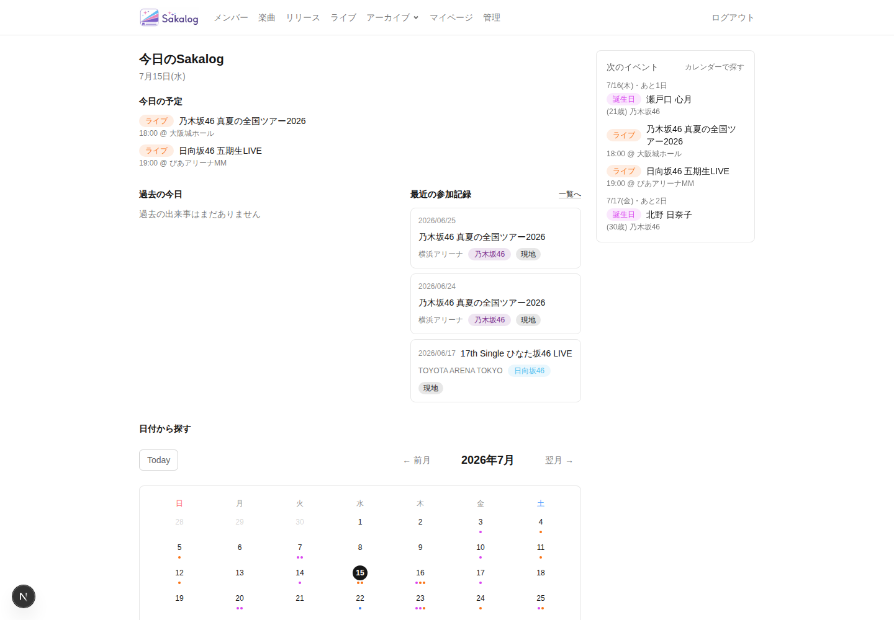
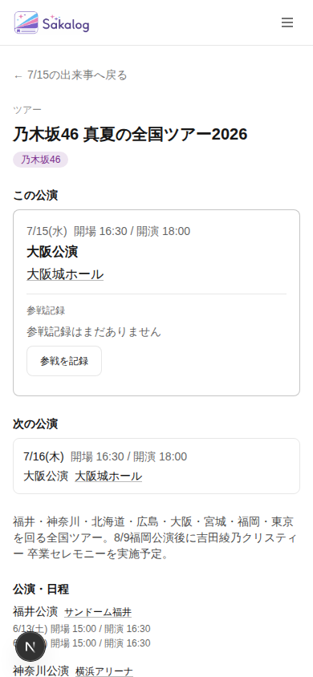
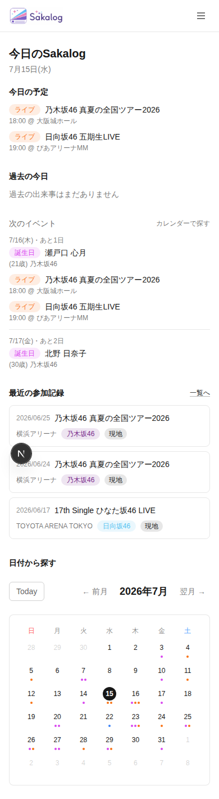
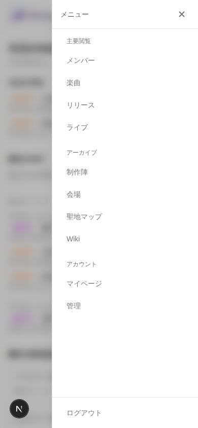
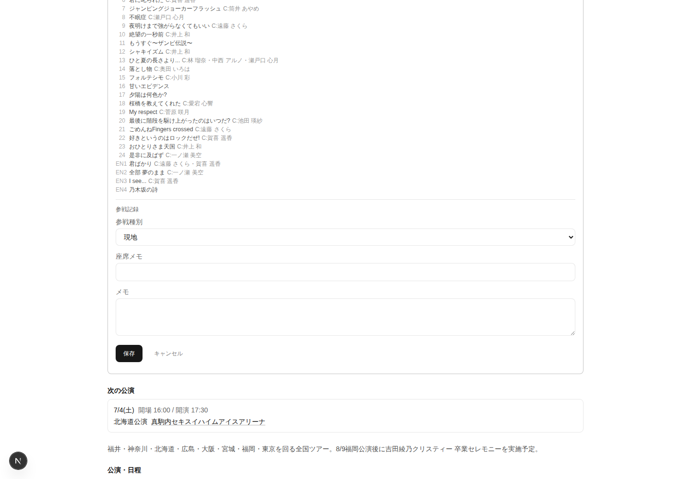
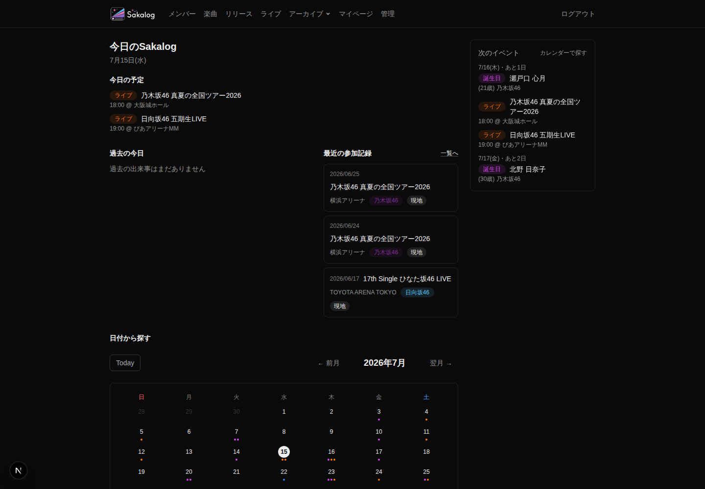

# Sakalog Primary Journey Integrated Design QA

- 実施日: 2026-07-15 JST
- 対象実装: `refactor/347-attendance-adjacency` / Issues #343〜#347 統合状態
- Viewport: Desktop 1440 × 1000、Mobile 390 × 844
- Current rendered implementation: `http://localhost:3001`
- Browser: Playwright CLI / Node runner + bundled Chromium
- 正典: [PRODUCT.md](../../../apps/oshikatsu-web/PRODUCT.md)、[DESIGN.md](../../../apps/oshikatsu-web/DESIGN.md)、Issue #341 Decision、[ADR 0013](../../decisions/0013-sakalog-primary-journey-daily-story.md)、Issue #343〜#347 Decision / Acceptance Criteria
- 比較対象: [2026-07-13 Sakalog Primary Flow Audit](./2026-07-13-sakalog-primary-flow.md)
- 変更方針: アプリケーションコード、正典、過去Audit reportは変更していない。本ファイルとQA evidenceのみを新規作成した。

## 1. Executive Summary

Issues #343〜#347により、Sakalogの通常のprimary journeyは大きく改善された。トップではDaily Storyがcalendarより先に現れ、日付から該当performanceへ進むリンクは`date + performance` contextを保持し、ライブ詳細では「この公演」→参戦記録→「次の公演」→ツアー全体の順で読める。元の日付へ戻る導線も実際の操作で成立した。

特にCF-001とCF-004は、2026-07-13 Auditの主要な断絶を解消している。Desktop/Mobileとも「今日」「過去の同日」「次の予定」「最近の参戦」「calendar」の優先順位が#341 Decisionと一致し、Sakalogが単なる月間カレンダーではなく、過去・今日・未来をつなぐ日次アーカイブとして理解できるようになった。

ただし、統合QAを最終acceptにはできない。主な理由は次の3点である。

1. contextなしのライブ詳細fallbackがDesktop/Mobileの両方でdocument-level horizontal overflowを起こす。Mobile 390pxで`scrollWidth=5410px`、Desktop 1440pxで`scrollWidth=5885px`だった。18件のPerformanceCardに参戦記録UIが反復し、#346の直接訪問fallbackと#347のattendance adjacencyが組み合わさった時の密度が高すぎる。
2. CF-002のcalendar semanticsと、CF-003のtouch target / month browsingは意図どおり未対応のままである。390pxの通常トップはreflowするが、日付は24 × 24px、月操作は約32〜34pxで、日付・曜日・今日・選択・イベント件数のアクセシブルな意味モデルもない。
3. CF-005 / CF-006の横断品質は部分改善に留まる。drawerはfocus trap / Escape / scroll lockを満たし、参戦記録のpending通知も追加された一方、reduced motion、フォームのエラー関連付け、live-region、`aria-current`、意味色コントラストが残る。Daily Storyは全期間データ取得を残したままNext Events用の月探索を増やしており、read costは構造上悪化した。

結論は「通常のcontextual primary journeyは条件付き採用可、統合Design QAとしてはblocked」。P1のfallback reflowとcalendar/accessibility baselineを解消し、P2の状態・性能hardeningを完了してから最終acceptする。

## 2. Primary Journey Verdict

### Journey health

| Step | 実操作結果 | Verdict | 根拠 |
|---|---|---|---|
| 1. トップページを開く | 認証済みトップをDesktop/Mobileで表示。主要console errorなし。 | ✅ | Daily Storyがfirst viewportに着地する。 |
| 2. 今日の予定を確認する | `Today`見出し直下に7/15の2公演を表示。 | ✅ | calendarより前。日付、時刻、会場、ライブ名が一走査で読める。 |
| 3. 過去の今日 / 選択日の過去同日を見る | 6/15、6/25を選択し、年別のPast Same-Dayが選択月日に追従。 | ✅ | [Desktop 6/15 evidence](./evidence/2026-07-15-sakalog-primary-journey/design-qa/desktop-04-selected-0615-past-same-day.png) |
| 4. 次のイベントを確認する | Desktopは右rail、MobileはPast Same-Day直後に4件表示。 | ✅ | #341 / #344のviewport別順序と一致。 |
| 5. 日付からイベントを探す | calendarから日付選択後、URLと選択日の予定が更新され、ページ上部に結果を表示。 | ⚠️ | 結果は見えるが、calendarの意味構造、touch target、月移動時の位置継続は未解決。 |
| 6. ライブ公演を選ぶ | 同日複数公演をperformance単位で選択可能。 | ✅ | リンクにlive IDだけでなくperformance IDを保持。 |
| 7. date + performance context付きでライブ詳細へ進む | URLが`/lives/{id}?date=2026-07-15&performance={id}`へ遷移。 | ✅ | contextはvalid performanceへfail-closedで適用。 |
| 8. 「この公演」を確認する | 対象日・時刻・地域・会場・参戦記録が最初のprimary surfaceに表示。 | ✅ | [Desktop contextual detail](./evidence/2026-07-15-sakalog-primary-journey/design-qa/desktop-06-contextual-live-viewport.png) |
| 9. 次の公演 / ツアー全体を把握する | 「次の公演」が対象公演直後、全日程がその後に表示。 | ✅ | 過去の全公演カード再探索を解消。 |
| 10. 参戦記録を確認・編集する | 既存記録を表示し、「編集」でshared formを開き、「キャンセル」で復帰。保存・解除は実行していない。 | ⚠️ | 情報は近接するが、setlistが長い公演では記録が下へ押される。編集開始時のfocusが`body`へ落ち、エラーsemanticsも不足。 |
| 11. 元の日付へ戻る | `← 7/15の出来事へ戻る`で`/?year=2026&month=7&day=15`へ戻り、上部から選択日storyを再表示。 | ✅ | return contextと選択日は保持。 |

### Overall journey statement

通常のトップ起点では、次の連続性が成立している。

`Daily Story → selected date → performance-level live link → この公演 → attendance → 次の公演 / tour → 元の日付`

2026-07-13時点の「日付からライブ全体へ飛び、該当公演と戻り先を再探索する」memory bridgeは解消された。一方、直接訪問時のfallback、calendar操作モデル、状態品質は別の断絶として残る。

## 3. CF-001〜CF-007 Status Matrix

| ID | Previous Finding | Current Status | Evidence | Remaining Gap |
|---|---|---|---|---|
| CF-001 | 日次価値と情報階層が画面構造へ反映されず、calendarと管理的なcard構成が第一印象だった。 | **Resolved** | Desktopは`Today → Today Schedule / Past Same-Day / Recent Attendance / Calendar`、右railにNext Events。Mobileは`Today → Past Same-Day → Next Events → Recent Attendance → Calendar`。いずれもcalendarより先に日次価値が現れる。[Desktop](./evidence/2026-07-15-sakalog-primary-journey/design-qa/desktop-02-top-full.png) / [Mobile](./evidence/2026-07-15-sakalog-primary-journey/design-qa/mobile-02-top-full.png) | MobileではNext Events 4件の縦量がToday Scheduleより大きく、未来情報が中盤を占有する。P3のdensity調整余地はあるが、hierarchy自体は成立。 |
| CF-002 | 日付・曜日・今日・選択・イベント件数を共有するcalendar semanticsがなく、色・リング・dotへ意味が分散。 | **Not addressed** | 現在も`div` grid、24pxの日付link、dot最大3件。日付linkに完全なアクセシブル名、`aria-current` / `aria-selected`、イベント件数がない。選択はvisual classのみ。[Calendar evidence](./evidence/2026-07-15-sakalog-primary-journey/design-qa/mobile-02-top-full.png) | #343〜#347のscope外というDecisionどおり。ARIA grid/table、完全日付名、today/selected semantics、件数と種別の非色依存表現が必要。 |
| CF-003 | Mobileの狭幅・touch・選択結果を一つの操作sequenceとして設計できず、過去Auditでは320px overflowも確認。 | **Improved but remaining** | 390pxの通常topは`scrollWidth=390`でreflowし、日付選択後はscroll topから結果が見える。Mobile orderもDecisionどおり。[Selected result](./evidence/2026-07-15-sakalog-primary-journey/design-qa/mobile-04-selected-0715.png) / [Previous month result](./evidence/2026-07-15-sakalog-primary-journey/design-qa/mobile-11-after-prev-month.png) | 日付linkは24 × 24px、月操作は約32〜34px。前月移動で選択日も同時に変わり、scroll topへ戻るため連続した日付探索が途切れる。結果更新のlive announcementもない。fallback detailでは別の重大overflowが発生。 |
| CF-004 | 日付起点の文脈がlive IDだけの詳細で失われ、該当公演と元の日付を再探索していた。 | **Resolved** | 実リンクに`date + performance`、detail first surfaceに「この公演」、続けて「次の公演」、tour overview、元の日付へのreturn linkを確認。invalid/direct contextは日付を推測せずライブ一覧へ戻す。[Contextual detail](./evidence/2026-07-15-sakalog-primary-journey/design-qa/mobile-06-contextual-live-full.png) / [Returned date](./evidence/2026-07-15-sakalog-primary-journey/design-qa/mobile-04-selected-0715.png) | 長いsetlistがある既参加公演ではattendanceが同じsurface内でもMobile y≈970まで下がる。context continuityは維持されるがadjacencyの視覚距離は要調整。 |
| CF-005 | semantic color、focus、pending/error、reduced motionが共通状態契約として定着せず、contrastやcurrent stateに問題。 | **Improved but remaining** | Global Navigation drawerはDialog semantics、focus trap、Escape、scroll lock、focus returnを満たす。attendanceは`aria-busy`と`role=status`でsave/delete pendingを通知。dark modeも構造崩れなし。[Drawer](./evidence/2026-07-15-sakalog-primary-journey/design-qa/mobile-03-navigation-open.png) / [Dark](./evidence/2026-07-15-sakalog-primary-journey/design-qa/desktop-12-top-dark.png) / [Form](./evidence/2026-07-15-sakalog-primary-journey/design-qa/desktop-11-attendance-edit.png) | nav activeに`aria-current`なし。drawerは`prefers-reduced-motion: reduce`でも0.2s transition。shared fieldsに`aria-invalid` / `aria-describedby`なし。FormErrorBannerにlive regionなし。既存の低contrast opacity/meaning color pairも残る。 |
| CF-006 | archive growthとtop read costが結び付き、全期間ライブ・リリース・動画取得と複数queryがdaily viewの固定費だった。 | **Regressed** | 全期間3系統取得は残存。#344のNext Eventsはcustom event / birthdayを最大12 calendar months追加走査し、Recent Attendanceも追加。dev実測はnetwork-idleまで1.48s、1.83s、8.05sと大きく変動。 | dev server値はproduction benchmarkではないが、read model上のfan-outとarchive比例costは明確に増えた。月/日/next/recent専用read modelとperformance budgetが必要。 |
| CF-007 | 日本語UI内に`Today`、外部遷移の説明不足、英語区切りが残り、copy ruleが不統一。 | **Improved but remaining** | 新しいnav、Daily Story、context detail、return link、attendance copyは概ね一貫した日本語で、目的語も明確。[Top copy](./evidence/2026-07-15-sakalog-primary-journey/design-qa/desktop-01-top-viewport.png) | MonthSelectorの`Today`だけはprimary journey内に残る。外部リンク/new tabと区切り文字のcopy ruleも今回scope外で未解決。 |

### CF判定の要点

- **Resolved:** CF-001、CF-004
- **Improved but remaining:** CF-003、CF-005、CF-007
- **Not addressed:** CF-002
- **Regressed:** CF-006
- **Regressed from previous status:** CF-006のみ。過去Audit本文やscoreは変更していない。

## 4. New regressions introduced by #343〜#347

以下は「現在の統合状態を過去Auditと比較して新たに確認できた回帰」である。git上の単一commit blameではなく、#343〜#347の組み合わせがcurrent rendered experienceへ与えた結果として評価する。

### REG-001 Direct fallbackがdocument-level horizontal overflowを起こす — P1

- 対象: contextなしの`/lives/{id}`、#346 direct-visit fallback
- Mobile: client width 390pxに対しdocument `scrollWidth=5410px`
- Desktop: client width 1440pxに対しdocument `scrollWidth=5885px`
- 影響: 横方向に巨大な空白と18枚の公演surfaceが連なり、reflow、現在位置、ページ全体の操作性を壊す。
- Evidence: [Mobile viewport](./evidence/2026-07-15-sakalog-primary-journey/design-qa/mobile-09-direct-fallback-viewport.png)、[Mobile full-page overflow](./evidence/2026-07-15-sakalog-primary-journey/design-qa/mobile-10-direct-fallback-full.png)
- 補足: fallbackのhorizontal performance carousel自体は以前から存在した構造を継承しているため、overflowの原因を#346だけへ帰属しない。ただし#346 Acceptance Criteriaがdirect fallbackを正式な体験として残した以上、今回のintegrated QAではblockerとして扱う。

### REG-002 fallback PerformanceCardの参戦記録反復密度が増えた — P1

- 18枚すべてに「参戦記録」submoduleを表示し、13件の「参戦を記録」buttonを確認した。
- #347はnested cardを解消したが、fallbackでは「見ているだけのユーザーへ全公演で記録を促す」構造になった。
- `PRODUCT.md`のquiet personal archive、ADR 0013のviewerを過剰にpromptしない方針、#347 Decisionのfallback density follow-upに反する。

### REG-003 setlist-rich performanceでattendance adjacencyが弱まる — P2

- 参戦済み6/25公演では「この公演」のfull setlistがattendanceより前に並び、Mobileでattendance開始が約y=970、次の公演が約y=1109、full page 1917pxになった。
- 未来公演やsetlistなしの公演では良好だが、思い出を確認・編集する過去公演ほどattendanceが遠くなる。
- Evidence: [Desktop attended detail](./evidence/2026-07-15-sakalog-primary-journey/design-qa/desktop-10-attended-detail.png)、[Mobile attended full](./evidence/2026-07-15-sakalog-primary-journey/design-qa/mobile-08-attended-context-full.png)

### REG-004 Daily Story追加後のread fan-out — P2

- 月表示、過去同日、今日、選択日に加え、Next Eventsのため最大12か月のcustom event / birthday queryを行う。
- `Promise.all`、selected month reuse、3か月で4件確定した場合のearly stopは良い実装だが、全期間ライブ・リリース・動画取得を残したままread surfaceを増やしたため、長期archiveほど不利になる。

### REG-005 attendance edit開始時のfocus loss — P2

- 「編集」を押すとtrigger buttonがunmountし、active elementが`body`へ移った。フォーム内の最初のcontrolや見出しへfocusされない。
- save/delete完了後のfocus returnとstatus通知は改善済みだが、edit開始のcontinuityが抜けている。

## 5. Desktop / Mobile comparison

| 観点 | Desktop 1440px | Mobile 390px | 評価 |
|---|---|---|---|
| Top hierarchy | 主列にToday / Past / Recent / Calendar、右railにNext Events。first viewportでstory全体を概観可能。 | Today / Past / Next / Recent / Calendarを縦積み。Calendarはy≈990。 | Decision準拠。Daily Story firstは両方で成立。 |
| Global Navigation | primary nav + Archive menu。menuはpointer/keyboard、Escape、trigger focus returnを確認。 | full-screen drawer。focus trap、Escape、scroll lock、focus returnを確認。 | #343はfunctional。active semanticsとreduced motionは残る。 |
| Date discovery | Calendarと選択結果を同じwide layoutで把握しやすい。 | Calendarまで約990px。日付選択後はtopへ戻り結果が見えるが、続けて別日を探すには再scrollが必要。 | Mobileの探索往復costが高い。 |
| Contextual live detail | 「この公演」「次の公演」「公演・日程」を1 viewport前後で把握。page width overflowなし。 | first viewportにreturn / title / この公演 / attendance / 次の公演が入る。通常contextは`scrollWidth=390`。 | #346の主要改善がMobileでも有効。 |
| Attended performance | 長いsetlistでattendanceが下へ移動するがwide viewportでは全体位置を理解しやすい。 | 同じ情報量が縦に伸び、attendanceと次の公演の発見costが大きい。 | Mobile優先でsection orderまたはsetlist progressive disclosureを見直す。 |
| Direct fallback | `scrollWidth=5885`でpage全体が横に拡張。 | `scrollWidth=5410`。full screenshotも5410px幅。 | 両viewportでP1。Mobileのみの問題ではない。 |
| Dark mode | 構造・surfaceは維持。muted text / badgeの視認性が弱い。 | 同一token契約のため同じrisk。 | theme-specific contrast hardeningが必要。 |

## 6. Accessibility / interaction observations

### Positive observations

- Mobile navigationは`dialog` / `aria-modal`を持ち、focus trap、Escape close、body scroll lock、openerへのfocus returnが実動作した。
- Desktop Archive menuは`aria-haspopup="menu"`、expanded state、menuitem semantics、Escape focus returnを持つ。
- attendance save/delete scopeに`aria-busy`があり、screen-reader用`role="status"`で「保存しています」「解除しています」を通知する。
- フォームのvisible labelとinput/select/textareaのlabel associationは成立している。
- context付きdetailはinvalid queryを推測せずfallbackし、誤った日付・公演をアクセシブル名として提示しない。
- 通常primary pathのDesktop/Mobileで主要console errorは確認しなかった。

### Actionable observations

1. **Calendar semantics:** 曜日headerと日付cellの関係が`div` gridに留まり、日付linkは「15」のような数字だけ。`aria-current="date"`、selected state、イベント件数・種別のtext alternativeがない。
2. **Touch targets:** 日付24 × 24px、Today約63 × 34px、前月/次月約62 × 32px。24pxはWCAG 2.2 AA minimumを満たすが、主要Mobile操作として40〜44pxのhit areaを確保すべき。
3. **Current navigation:** active navはvisual font/colorのみで、`aria-current="page"`がない。
4. **Reduced motion:** `prefers-reduced-motion: reduce`でもdrawer backdrop/panelのtransition durationは0.2s、transform/opacity transitionも残る。`DESIGN.md`のmovement removalと不一致。
5. **Edit focus:** editing stateへの切替時にfocusが`body`へ落ちる。最初のfield、form legend、またはform containerへfocusを移す必要がある。
6. **Shared field errors:** Input / Select / Textareaに`aria-invalid`と、error message IDを参照する`aria-describedby`がない。視覚エラーがassistive technologyへ接続されない。
7. **FormErrorBanner:** styled paragraphのみで`role="alert"` / `aria-live`がない。submit後のform-level errorを非視覚利用者が即時認識できない。
8. **Danger weight:** 「解除」は白文字+solid redで、隣の「編集」outlineより強い。参戦記録を育てるprimary taskよりdestructive actionが目立つ。red foreground/background pairも既知のcontrast riskがある。
9. **Meaning colors / muted text:** light/dark双方でopacity-based textと同系色badge pairを継続利用。過去Auditで確認した2.55:1〜3.18:1の低contrast class contractがcurrent codeにも残る。
10. **Result feedback:** 日付選択でtopへ戻るためvisual resultは見えるが、更新を伝えるlive regionはない。calendarを連続操作するkeyboard/screen-reader userにはcontext switchが唐突。

## 7. Information hierarchy / emotional journey assessment

### Information hierarchy

Daily Storyの情報階層は成立した。ページを開いた直後に「今日は何があるか」を理解し、そのまま「同じ日に過去何があったか」「次は何があるか」「最近どこへ行ったか」へ進める。Calendarはこれらの後に置かれ、主役から探索toolへ役割が変わった。

Desktopのright railはNext Eventsを常時比較でき、現在と未来の距離を短くする。Mobileは同じ情報を単純縮小せず、Past Same-Dayの直後へNext Eventsを移している点が良い。Global Navigationもprimary / archive / accountの役割が明確になり、以前の重複nav感は低下した。

ライブ詳細では「この公演」が視覚的にも情報順でもtargetになり、全ツアーの中で現在地を探す必要がない。「次の公演」を1段弱いsurfaceで近接し、ツアー全体をquiet overviewへ下げた構成は#341 Decision、ADR 0013、`DESIGN.md`のcard抑制に沿う。

### Emotional journey

改善後の通常flowは次の感情曲線を作れている。

1. **Today / anticipation:** 今日の予定が最初に見え、「開く理由」がある。
2. **Past Same-Day / recollection:** 同じ月日の過去が年ごとに現れ、archiveが育つ価値を感じる。
3. **Next Events / anticipation:** 今日の延長として近い未来を確認できる。
4. **This Performance / confidence:** 選んだ公演へ確実に着地し、現在地を再探索しなくてよい。
5. **Attendance / ownership:** 自分の記録が公演context内にある。
6. **Return / continuity:** 元の日付へ戻り、同日の別eventや別の記憶を続けて見られる。

一方、fallbackでは感情曲線が「ツアー全体を読む」から「各公演で記録を求められる」へ変わり、quiet archiveというtoneを失う。setlist-rich performanceでも、最も個人的なattendanceが長い客観情報の後ろへ置かれ、記憶を確認するmomentumが弱くなる。MobileのNext Eventsも4件全表示がToday sectionより大きいため、状況によっては「今日」より未来が視覚的に支配する。

## 8. Prioritized Findings

### P0

該当なし。通常のprimary journeyは完遂でき、保存済みデータを壊す操作や認証・navigationの全面停止は確認しなかった。

### P1

#### DQA-P1-001 Direct fallbackのdocument overflowとattendance反復を解消する

- **根拠:** Mobile 390pxで5410px、Desktop 1440pxで5885pxのdocument width。18個の参戦記録submodule、13個のrecord CTA。
- **対象flow:** #346 direct visit / invalid context fallback。primary journeyのdeep-link resilienceとライブ一覧起点。
- **PRODUCT / DESIGN / Decision:** `PRODUCT.md` Principle 4のcalmさ、WCAG 2.2 AA reflow、`DESIGN.md`のcard抑制、ADR 0013のviewerを過剰にpromptしない方針、#346 fallback AC、#347 critique follow-upに不一致。
- **推奨対応:** carouselをviewport内の独立scroll regionへcontainし、祖先へ`min-width: 0` / max-width contractを持たせる。全cardへfull AttendanceControlを反復せず、compact attendance status、選択/展開した1公演だけのaction、または日付選択後にcontext viewへ遷移する構造へ変更。390 / 1440 / keyboardで再検証。

#### DQA-P1-002 Calendarへ共有semantic state modelを導入する

- **根拠:** 完全日付名、today、selected、event count/type、曜日relationがassistive technologyへ公開されない。色とdotだけに意味が残る。
- **対象flow:** 5. 日付からイベントを探す、3. 過去同日を選択日に追従させる。
- **PRODUCT / DESIGN / Decision:** `PRODUCT.md` WCAG 2.2 AA、Principle 3、`DESIGN.md` Calendar / Meaningful Color / selected state規約。#341で後続対応としたCF-002。
- **推奨対応:** 先にcalendar information modelをDecision化し、tableまたはARIA grid、full accessible name、`aria-current="date"`、selected state、count/type summaryを同じmodelから描画する。dotはvisual supplementに限定。

#### DQA-P1-003 Primary journeyのcontrast / state baselineをWCAG 2.2 AAへ合わせる

- **根拠:** current UIにもopacity-based muted text、同系色foreground/background badgeが残り、過去Auditの2.55:1〜3.18:1 contractが継続。active navigationも視覚表現のみ。
- **対象flow:** 1〜11全体、特にcalendar、badges、return link、secondary metadata、danger action。
- **PRODUCT / DESIGN / Decision:** `PRODUCT.md`のWCAG 2.2 AA、`DESIGN.md` Semantic Colors / Focus / Current Stateに直接不一致。CF-005は#343〜#347の本格scope外。
- **推奨対応:** theme別semantic color pairをtoken化して自動contrast testを加える。`foreground/40`等を用途tokenへ置換し、nav `aria-current`、2px focus-visibleを共通component ACにする。

### P2

#### DQA-P2-001 Mobile calendarのtouchと連続探索を再設計する

- **根拠:** 24px日付、32〜34px月操作。前月移動で選択日も変更しtopへ戻るため、calendarへ再scrollが必要。
- **対象flow:** 5、3、6。
- **PRODUCT / DESIGN / Decision:** `DESIGN.md`のMobile usability、#341で後続としたCF-003。
- **推奨対応:** visual circleは24pxのまま40〜44px hit areaを持たせる。month browseとselected dateを分離するか、選択後もcalendar近傍へ結果summaryを出す。更新結果をannouncerで通知。

#### DQA-P2-002 attendance adjacencyをsetlist量に依存させない

- **根拠:** setlist-rich mobileでattendance y≈970。過去公演ほど自分の記録が遠い。
- **対象flow:** 8、10、9。
- **PRODUCT / DESIGN / Decision:** `PRODUCT.md` Principle 2、ADR 0013のattendance adjacency、#347 Decision。
- **推奨対応:** 「この公演」内でattendanceを基本情報直後へ上げる。setlistはsummary + detail link、またはcollapsed regionとし、次の公演までのread costを一定にする。

#### DQA-P2-003 attendance formのerror / focus semanticsを完成させる

- **根拠:** edit開始でfocusが`body`へ移動。shared fieldsに`aria-invalid` / `aria-describedby`なし。FormErrorBannerにlive regionなし。
- **対象flow:** 10。
- **PRODUCT / DESIGN / Decision:** `PRODUCT.md` WCAG 2.2 AA、`DESIGN.md` Focus / Error / Recovery、#347 ACとcritique follow-up。
- **推奨対応:** edit開始時にform headingまたはfirst invalid/first fieldへfocus。各errorにstable IDを持たせてfieldから参照。form-level errorは`role="alert"`または適切なassertive/polite live region。focus/error順をPlaywright + screen reader spot check。

#### DQA-P2-004 「解除」のvisual weightを下げる

- **根拠:** solid redの「解除」がoutlineの「編集」より強く、記録を育てるflowでdestructive actionがdominant。
- **対象flow:** 10。
- **PRODUCT / DESIGN / Decision:** Principle 2 / 4、`DESIGN.md` Semantic Colors、#347 critique follow-up。
- **推奨対応:** danger text/quiet secondaryへ下げ、confirmationで意図を確保する。pending / error時だけdanger meaningを強め、normal stateでは編集をprimary actionとして読む。

#### DQA-P2-005 top page read modelをDaily Story専用にする

- **根拠:** 全期間3系統取得 + today / selected / month / same-day + Next Events最大12か月 + recent attendance。dev navigation値は1.48〜8.05sで不安定。
- **対象flow:** 1〜5。
- **PRODUCT / DESIGN / Decision:** 長期archiveほどdaily openが遅くなる点がProduct Purposeと逆行。CF-006。
- **推奨対応:** month range、selected date、month-day history、next 4、recent 3をbackend query/RPCで直接返すTopPage read DTOへ分離。payload/query count、TTFB、LCPのbudgetを定めproduction-like data volumeで測定。

#### DQA-P2-006 reduced motionをdrawerとnavigation transitionへ適用する

- **根拠:** reduced motionでもdrawer panel/backdropの0.2s movement/opacity transitionが残る。
- **対象flow:** 1、global navigation。
- **PRODUCT / DESIGN / Decision:** `PRODUCT.md` OS setting尊重、`DESIGN.md` Reduced Motion、#343 Navigation ACのinteraction quality。
- **推奨対応:** reduce時はtransform movementを除去し、必要ならinstant state changeまたは非移動の短いopacity changeに限定。実際のmedia emulationで検証。

### P3

#### DQA-P3-001 `Today`を「今日」へ統一する

- **根拠:** MonthSelectorだけ英語。新しいDaily Storyとnavは日本語へ整ったため、残差が目立つ。
- **対象flow:** 5。
- **関係:** CF-007、`DESIGN.md` UX copy consistency。
- **推奨対応:** 「今日」へ変更し、external/new-tab表現と日本語区切りをcopy checklistへ加える。

#### DQA-P3-002 Mobile Next Eventsの密度をTodayとのhierarchyで調整する

- **根拠:** 4件全表示のNext Eventsが約300pxを占め、Today Scheduleより大きい。
- **対象flow:** 2〜4。
- **関係:** #341 / #344のorderは満たすが、Daily Storyのemotional hierarchyにpolish余地。
- **推奨対応:** 同日groupingの圧縮、secondary metadata削減、4件目以降のquiet expansionを比較し、Todayのvisual priorityを維持。

## 9. Recommended Roadmap

| Phase | 優先 | 実装テーマ | Exit criteria |
|---|---|---|---|
| 0 | P1 | Direct fallback containment + attendance density | 390 / 1440でdocument overflowなし。横scrollは明示したregion内だけ。full AttendanceControlの反復なし。direct URLからライブ一覧へ戻れる。 |
| 1 | P1/P2 | Calendar semantics + Mobile interaction | table/ARIA grid、full date name、today/selected/count semantics、40〜44px hit area、month browsing/result feedbackをDesktop/Mobile/keyboardで確認。 |
| 2 | P1/P2 | State and accessibility hardening | AA contrast、`aria-current`、2px focus、reduced motion、shared field errors、FormError live region、edit focus continuityが共通component ACを満たす。 |
| 3 | P2 | Attendance hierarchy polish | setlist量にかかわらずattendanceがtarget basic info直後。danger actionはsecondary。registered / empty / edit / pending / errorの全stateをQA。 |
| 4 | P2 | Daily Story read model optimization | archive全件取得を廃止。query count/payload/TTFB/LCP budgetを定義し、代表的archive volumeで計測。 |
| 5 | P3 | Copy / density polish + integrated rerun | 「今日」統一、external copy rule、Mobile Next density。1440 / 390 / dark / reduced motion / keyboard / screen-reader spot checkを再実施。 |

依存関係は`fallbackを止血 → calendar state model → shared state hardening → attendance hierarchy → read optimization → integrated rerun`とする。Calendarのvisual patchだけを先行するとsemanticsとselection behaviorが再度分岐するため、Phase 1はDecision + implementation acceptanceを一体で扱う。

## 10. Design QA verdict

### Primary journeyを採用できるか

**条件付き採用可。** トップ起点のcontextual journey自体は、CF-001とCF-004を解消し、#341 DecisionとADR 0013の狙いをcurrent rendered implementationで実現している。日常利用の主導線として採用してよい。

ただし、release / integrated acceptanceとしては**blocked**。P1のdirect fallback reflow、calendar semantics、contrast/state baselineが残るため、Sakalogのprimary journey全体を完成扱いにはできない。

### 次に実装すべき項目

1. Direct fallbackのdocument overflowを止め、fallback PerformanceCardからfull attendance actionの反復を除く。
2. CF-002 / CF-003を一つのcalendar interaction modelとしてDecision化し、semantics、touch、month browse、result feedbackを実装する。
3. shared form errors、FormErrorBanner、edit focus、reduced motion、semantic colorsを共通component levelでhardeningする。
4. attendanceをsetlistより先に置き、「解除」をquiet destructive actionへ調整する。
5. Daily Story専用read modelとperformance budgetを導入する。

### Impeccable Technical Auditへ渡すべき観点

- fallback overflowのcontaining block / flex item `min-width` / scroll container境界と、390 / 320 / 200% zoomのreflow
- EventCalendarのDOM semantics、accessible name computation、`aria-current` / selected / event count、keyboard interaction model
- semantic color pairのlight/dark contrast自動測定、focus-visible token、active nav state
- `prefers-reduced-motion`で残るHeadless UI transition classとnavigation progress motion
- shared Input / Select / Textareaのerror ID contract、`aria-invalid`、`aria-describedby`、FormErrorBanner live region
- AttendanceControlのedit/pending/success/error/delete focus sequenceとannouncement重複
- contextual detailのsetlist DOM量、attendance / next performanceまでのread cost、fallbackの18 control repetition
- `getTopPageContent`のquery fan-out、全期間repository call、Next Eventsの最大12か月batch、cache hit/miss、payload、TTFB/LCP
- nav / drawer / calendar / contextual returnを含むPlaywright keyboard regression coverage

## Run Notes

- in-app Browserはこの環境で利用できなかった。ユーザー承認のもと、**Playwright CLI / Node runnerとbundled Chromiumをevidence fallbackとして使用**した。
- 認証済みstorage stateは`http://localhost:3001`に対してのみ使用し、外部サイトは操作していない。
- Desktop 1440 × 1000、Mobile 390 × 844でprimary journeyを実操作した。full-page screenshotも必要箇所で取得した。
- 保存済み参戦記録は閲覧のみ。「編集」を開いて「キャンセル」し、保存・解除は実行していない。一時QAデータの作成も不要だったため、ユーザーデータ変更はない。
- performance値はlocal dev server / network-idle基準で、production benchmarkではない。3回のDesktop top navigationは1.48s、1.83s、8.05s。変動自体を懸念材料とし、絶対値による合否判定には使っていない。
- current direct fallback計測: Mobile `clientWidth=390 / scrollWidth=5410 / scrollHeight=3376`、Desktop `clientWidth=1440 / scrollWidth=5885 / scrollHeight=1744`。
- 一部の初期captureはhost mismatchによるlogin画面または月遷移中のraceが含まれたため、Finding evidenceから除外した。上記本文からリンクしたcaptureだけを判定根拠として使用した。
- 正式保存するevidenceは、本文から直接参照する16枚に限定した。初期capture、重複状態、判定根拠に使わなかった画像は一時QA artifactとしてGit管理対象から除外した。
- 過去Auditはpoint-in-time snapshotとして保持し、本文・Finding・scoreを変更していない。本reportのStatusは現在実装に対する新しい評価である。
- アプリケーションコード、`PRODUCT.md`、`DESIGN.md`、ADR、過去Audit reportは変更していない。

**Final result: blocked**
