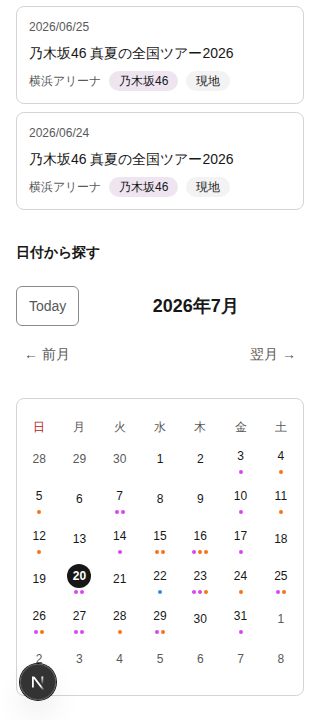
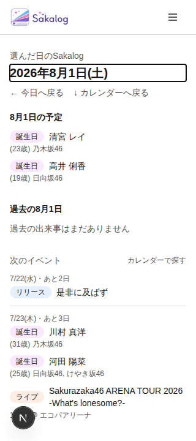

# Sakalog Calendar Primary Date Exploration Focused Design QA

- 実施日: 2026-07-20 JST
- 対象: Issue #361 / #362完了後の`main` (`1bdeb48`)
- Decision source: Issue #358（semantic HTML table + date link、native Tab / Enter、result focus contract）
- 対象flow: 月を移動する → 日付を探索・選択する → Daily Story結果を理解する → Calendarへ戻って再探索する
- Viewport: 320 × 720、390 × 844、1440 × 1000
- Browser: Playwright CLI + bundled Chromium
- 正典: `apps/oshikatsu-web/PRODUCT.md`、`apps/oshikatsu-web/DESIGN.md`、Issue #358 / #361 / #362
- Evidence: [`./evidence/2026-07-20-sakalog-calendar-primary-date-exploration-design-qa/`](./evidence/2026-07-20-sakalog-calendar-primary-date-exploration-design-qa/)
- 変更方針: アプリケーションコードは変更していない。本report、evidence、Design Audit索引のみを追加した。

## 1. Executive Summary

**判定: Focused Design QA PASS。P0 / P1なし、P2 hardeningが1件。**

#361のsemantic date modelは、native table、7曜日header、42 date link、full date name、todayの`aria-current="date"`、selectedの「選択中」、event count/type summary、decorative dotという#358 Decisionを満たした。実データでは「2026年7月3日、イベント1件（誕生日1件）」のように、色dotを見なくても日付とevent contextを判別できる。

#362のnarrow interactionは、320 / 390pxで2段MonthSelectorへreflowし、root overflowを発生させない。320pxはmonth control 40px、date link約40.3 × 40px、390pxは44px、date link約46.3 × 44pxを確保し、24pxのselected visual circleは維持した。月移動後は操作buttonへfocusが残り、単一statusが新しい月と選択日を通知する。日付選択後はDaily Story見出しへfocusし、「カレンダーへ戻る」でCalendar見出しへ戻った後の次TabがTodayへつながる。

primary date explorationはkeyboard / touchの双方で連続して完遂できる。残るP2は、programmatic focus先のH1 / H2が共通focus tokenではなくbrowser defaultの1px auto outlineへ依存している点である。light / darkの今回のChromiumでは視認できたが、Sakalogの2px semantic focus契約と一致せず、browser差を残す。

## 2. Focused Journey Health

| Step | 操作 / 確認 | General health | Evidence |
|---|---|---|---|
| 1 | 320 / 390 / 1440pxでCalendarへ到達 | **Healthy** — root overflowなし。Calendar heading、MonthSelector、tableが欠けずに表示。 | [320](./evidence/2026-07-20-sakalog-calendar-primary-date-exploration-design-qa/01-320-calendar-initial.png) / [390](./evidence/2026-07-20-sakalog-calendar-primary-date-exploration-design-qa/06-390-calendar-initial.png) / [1440](./evidence/2026-07-20-sakalog-calendar-primary-date-exploration-design-qa/09-1440-calendar-initial.png) |
| 2 | keyboardでevent日付へfocus | **Healthy** — 24px circleに2px focus outline。40 / 44px hit areaは維持。 | [320](./evidence/2026-07-20-sakalog-calendar-primary-date-exploration-design-qa/02-320-date-focus.png) / [390](./evidence/2026-07-20-sakalog-calendar-primary-date-exploration-design-qa/07-390-date-focus.png) / [1440](./evidence/2026-07-20-sakalog-calendar-primary-date-exploration-design-qa/10-1440-date-focus.png) |
| 3 | 翌月へkeyboard移動 | **Healthy** — focusは「翌月」に残り、`2026年8月、20日を選択中`を単一statusで公開。 | [320 next month](./evidence/2026-07-20-sakalog-calendar-primary-date-exploration-design-qa/03-320-next-month-focus-status.png) |
| 4 | event日付をEnterで選択 | **Healthy with hardening** — URL / resultが更新され、Daily Story H1へfocus・scroll。browser default outlineは見えるがP2。 | [320 result](./evidence/2026-07-20-sakalog-calendar-primary-date-exploration-design-qa/04-320-date-result-focus.png) |
| 5 | 「カレンダーへ戻る」で再探索へ戻る | **Healthy with hardening** — `#calendar`がviewport内でfocusされ、次TabはToday。H2 outlineはP2と同じ契約差。 | [320 return](./evidence/2026-07-20-sakalog-calendar-primary-date-exploration-design-qa/05-320-return-calendar-focus.png) |
| 6 | 390pxでtouch選択 | **Healthy** — target誤操作やroot horizontal shiftなし。Daily Story resultへ着地。 | [390 touch result](./evidence/2026-07-20-sakalog-calendar-primary-date-exploration-design-qa/08-390-touch-date-result.png) |
| 7 | dark modeでkeyboard result focus | **Healthy with hardening** — focus outlineは視認可能だがbrowser default 1px。 | [390 dark result](./evidence/2026-07-20-sakalog-calendar-primary-date-exploration-design-qa/11-390-date-result-focus-dark.png) |

## 3. Acceptance Matrix

| Contract | 判定 | 実測 / 観察 |
|---|---|---|
| native semantic table | ✅ | table caption + 7 column headers + 42 native date links。 |
| full date / weekday relation | ✅ | date linkは年月日を持ち、曜日はnative column header relationで提供。 |
| today / selected | ✅ | todayのみ`aria-current="date"`、selectedはaccessible nameに「選択中」。各1件。 |
| event count / type summary | ✅ | event日だけ総数と種別内訳。title列挙なし。 |
| non-color event information | ✅ | dot containerは全て`aria-hidden`; accessible nameと結果listで情報を提供。 |
| native keyboard model | ✅ | Tab / Shift+Tab + Enter。roving tabindexやarrow-key横取りなし。 |
| 320 / 390 reflow | ✅ | MonthSelectorは2段。全controlがviewport内でroot overflowなし。 |
| hit area / 24px visual circle | ✅ | 320: date約40.3 × 40px、390: 約46.3 × 44px、1440: 約96.8 × 44px。circleは全幅24 × 24px。 |
| month browse focus / announcement | ✅ | 押したbuttonへfocus維持。初期statusは空、移動後だけ月+選択日を通知。 |
| date selection result feedback | ✅ | Calendar起点の選択だけDaily Story H1へfocus。重複live announcementなし。 |
| return path | ✅ | `#calendar` H2へfocusし、次TabがToday。 |
| touch exploration | ✅ | 390pxのevent日をtouch selectionし、root `scrollX=0`。 |
| long content wrap | ✅ | selected resultのevent/live/birthday/venue copyは320 / 390pxで横overflowせずwrap。 |

### Viewport measurements

| Width | Root client / scroll | Month controls | Date link | Visual circle |
|---:|---:|---:|---:|---:|
| 320 | 320 / 320 | 40px | 40.28 × 40px | 24 × 24px |
| 390 | 390 / 390 | 44px | 46.28 × 44px | 24 × 24px |
| 1440 | 1440 / 1440 | 44px | 96.84 × 44px | 24 × 24px |

## 4. Prioritized Findings

### P0

該当なし。

### P1

該当なし。date discovery、selection、result feedback、return pathの停止やoffscreen focusは確認しなかった。

### P2-001 Programmatic focus destinationをsemantic focus contractへ統一する

- **Evidence:** Calendar選択後のDaily Story H1と、return後の`#calendar` H2は`tabIndex=-1`で正しくfocusされるが、styleはbrowser defaultの`outline: auto 1px`。Calendar date / MonthSelectorの2px `focus-ring` tokenとは異なる。
- **Impact:** 今回のChromiumではlight / darkとも見えるが、browser / OS依存で見え方が変わる。日付選択時のresult feedbackをfocusへ一本化した#358 Decisionに対して、視覚的な現在地だけが共通保証を持たない。
- **Recommendation:** `DailyStoryHeading`と`#calendar` headingへ、programmatic keyboard focus時に2px semantic outline + offsetを適用する。touch起点では不要なringを出さないよう`:focus-visible`を維持する。

### P3 / Existing copy residue

- MonthSelectorの`Today`は日本語UI内で唯一英語のまま。#362のNon-goalであり今回の回帰ではないが、過去Auditのcopy residueは継続している。独立したcopy polishで「今日」へ統一できる。

## 5. Confirmed Strengths

- 24px visual circleを変えずにlink hit areaをcell全体へ広げ、密度とtouchabilityを両立した。
- 320pxではcalendar左右paddingを詰めてもborder、曜日、dotの間隔が崩れず、40px hit targetを確保している。
- MonthSelectorの2段化はToday / month label / prev / nextの役割を分け、狭幅でも誤タップしにくい。
- event dotは意味のある小さな彩りとして残しつつ、accessible nameと結果listが情報の正本になっている。
- date selectionは結果へ進み、return linkはCalendar探索へ戻すため、page上部と下部を往復してもfocusが画面外に残らない。
- touch選択ではkeyboard用focus outlineを強制表示せず、結果headingとcontent hierarchyだけを見せる。

## 6. Verification Record and Limits

### Passed

- Focused evidence spec: 1 passed
- Existing Calendar regression: 27 passed / 1 desktop-only skip
  - `playwright/event-calendar-semantics.spec.ts`
  - `playwright/calendar-narrow-interaction.spec.ts`
  - desktop / mobile projects
- Unit suite: 10 files / 65 tests passed（`calendarSemantics.test.ts`を含む）
- `pnpm --filter oshikatsu-web typecheck`
- `pnpm --filter oshikatsu-web lint`

### Limits

- Browser evidenceはユーザー指定済みのbundled Chromium。WebKit / Firefox差は今回の判定に含めていない。
- table / accessible name / `aria-current` / status text / focus移動は確認したが、VoiceOver / NVDA等による実発話、曜日headerの発話順、statusの重複は未確認。
- touchはChromium DevTools Protocolのtouch input。実機の指サイズ、慣性、OS browser chromeを含む誤操作率は未評価。
- 200% / 400% zoomとOS high-contrast modeは未実施。

## 7. Decision

- **#361:** Focused Design QA PASS。#358 semantic contractを満たす。
- **#362:** Focused Design QA PASS。320 / 390px reflow、hit area、month announcement、result focus、return pathを満たす。
- **Follow-up:** P2-001はIssue closeを妨げないhardening。focus destinationを共通tokenへ揃える場合は、他のprogrammatic heading focusとまとめてIssue化する。
