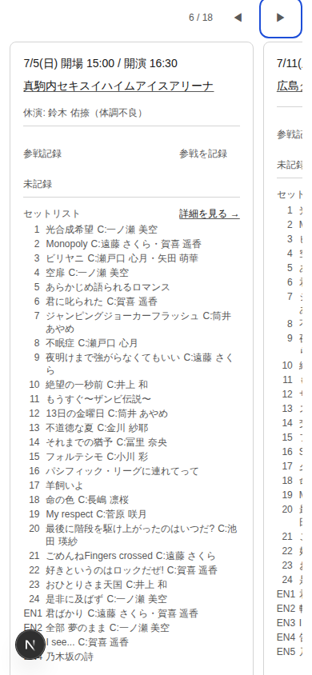
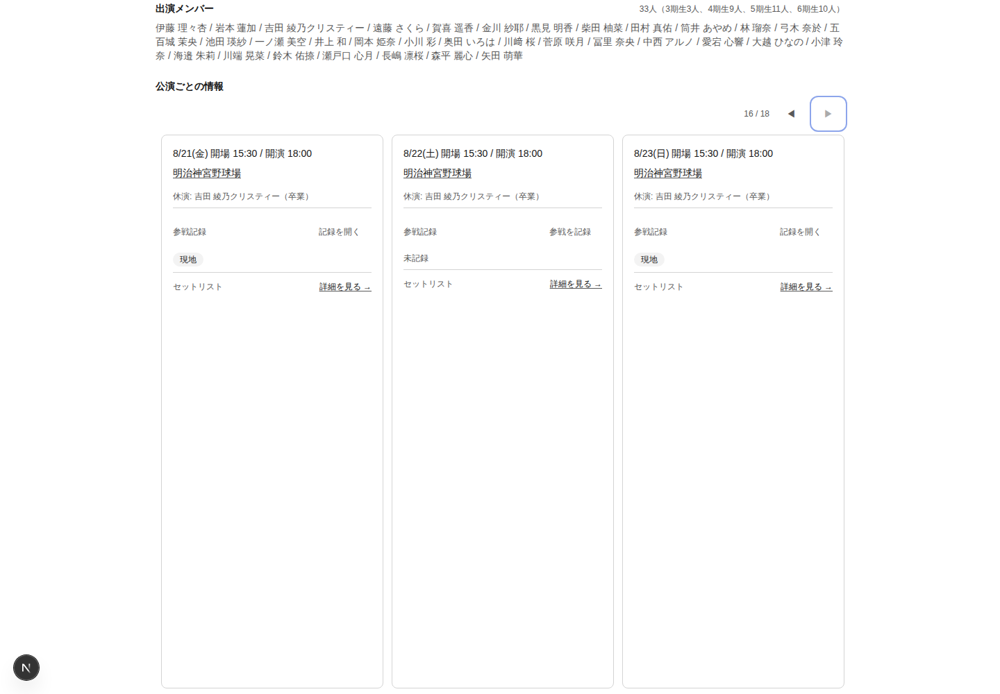

# Sakalog Live Detail Direct Fallback Carousel Focused Design QA

- 実施日: 2026-07-20 JST
- 対象: Issue #377 / #363 / #357 / #376、PR #388 merge後の `main` (`1bdeb48`)
- 対象画面: contextなし / invalid contextのLive Detail fallback carousel
- Viewport: 320 × 720、390 × 844、1440 × 1000
- Browser: Playwright CLI + bundled Chromium
- 正典: `apps/oshikatsu-web/PRODUCT.md`、`apps/oshikatsu-web/DESIGN.md`、Issue acceptance criteria
- Evidence: [`./evidence/2026-07-20-sakalog-live-detail-carousel-design-qa/`](./evidence/2026-07-20-sakalog-live-detail-carousel-design-qa/)
- 変更方針: アプリケーションコードは変更していない。本report、evidence、Design Audit索引のみを追加した。

## 1. Executive Summary

**判定: Chromium focused QAは条件付きPASS。P0 / P1なし、P2が2件、browser / assistive technology coverage gapが1件。**

#357のroot containment、#363のcompact attendance、#376のsemantic focus ring、#377のvisible-card keyboard modelは、320 / 390 / 1440pxの実操作で主要契約を満たした。rootは全幅で`scrollWidth === clientWidth`、inner carouselだけがscrollし、trackpad相当wheelとtouch dragの双方で`scrollLeft`が変化した。CSSは`scroll-snap-type: x mandatory`と`contain: paint`を維持した。

Keyboardではprev / next / Arrowの反復で1件目、中間6件目、18件目へ進み、18件目のvenue / attendance / setlistへTabで到達した。carousel内Tab対象は320 / 390pxで3件、1440pxで9件に絞られ、offscreen tabbableは全幅0件だった。位置statusは`1 / 18`、`6 / 18`、`18 / 18`と日付・時刻contextを更新した。

ただし、1440pxでは3カードが同時に操作可能なのにstatusは「先頭可視カード」だけをactiveとして扱う。終端では16〜18件目が見えていても`16 / 18`のままで、18件目のactionへTab移動してもposition contextはfocus対象へ追従しない。さらにカード列が最長setlistの高さに揃うため、setlistが短い終端カードに大きな空白が生まれ、compact attendanceの落ち着いた密度を視覚的には弱めている。

## 2. Focused Journey Health

| Step | 操作 / 確認 | General health | Evidence |
|---|---|---|---|
| 1 | direct fallbackを320 / 390 / 1440pxで開く | **Healthy** — root overflowなし。carouselはviewport内へcontain。 | [320 initial](./evidence/2026-07-20-sakalog-live-detail-carousel-design-qa/01-320-initial.png) / [1440 initial](./evidence/2026-07-20-sakalog-live-detail-carousel-design-qa/07-1440-initial.png) |
| 2 | prev / nextへTabし、Arrowで先頭から中間へ移動 | **Healthy** — focus ringはviewport内、statusは`6 / 18`へ更新。 | [390 keyboard mid](./evidence/2026-07-20-sakalog-live-detail-carousel-design-qa/04-390-keyboard-mid.png) |
| 3 | Arrow反復で18件目へ移動 | **Healthy at narrow widths** — 390pxでは`18 / 18`と公演日程が一致。 | [390 last](./evidence/2026-07-20-sakalog-live-detail-carousel-design-qa/05-390-last-performance.png) |
| 4 | active card内のvenue / attendance / setlistへTab | **Healthy** — 3 actionすべてcarousel viewport内で到達。 | [390 last](./evidence/2026-07-20-sakalog-live-detail-carousel-design-qa/05-390-last-performance.png) |
| 5 | attendanceを展開し、最初のfieldへfocus | **Healthy** — initial form 0、expanded form 1。Selectへfocusし、2px ringを確認。 | [Light](./evidence/2026-07-20-sakalog-live-detail-carousel-design-qa/06-390-attendance-focus-light.png) / [Dark](./evidence/2026-07-20-sakalog-live-detail-carousel-design-qa/07-390-attendance-focus-dark.png) |
| 6 | trackpad相当wheel / touch dragで横移動 | **Healthy** — inner `scrollLeft`のみ変化し、root `scrollX=0`、mandatory snapを維持。 | Runtime measurement |
| 7 | 1440pxで終端まで探索 | **Needs refinement** — 到達はできるが、複数可視時のactive contextとカード高にP2。 | [1440 last](./evidence/2026-07-20-sakalog-live-detail-carousel-design-qa/08-1440-last-performance.png) |

## 3. Acceptance Matrix

| 確認項目 | 判定 | 実測 / 観察 |
|---|---|---|
| keyboard exploration | ✅ | prev / next / Arrowで1→6→18、Tabでcard actionへ進行。 |
| offscreen focus | ✅ | offscreen tabbable 0。card変更時もactive elementはcarousel viewport内。 |
| active performance context | ⚠️ | 320 / 390pxは日付・時刻とpositionが一致。1440pxの複数可視・複数Tab対象では先頭可視cardに固定。 |
| n / total announcement | ✅ / coverage note | `role=status[aria-live=polite]`が`1 / 18`→`6 / 18`→`18 / 18`と更新。実screen readerの発話は未確認。 |
| venue / setlist / attendanceへの到達 | ✅ | 18件目でvenue link、attendance disclosure、setlist linkをkeyboardだけで到達。 |
| touch / trackpad / snap | ✅ | wheel: `scrollLeft 4→625`、touch drag後`2534`、root `scrollX=0`、`x mandatory`。 |
| root overflow | ✅ | root client/scroll width: `320/320`、`390/390`、`1440/1440`。inner widthは全幅でoverflow。 |
| compact attendance | ✅ | 初期form 0、展開時1。registered badgeとquiet disclosureを維持。 |
| 320 / 390 / 1440 | ✅ | 3幅でroot、focus budget、offscreen focus、position、snapを計測。 |
| light / dark focus | ✅ | light `rgb(29, 78, 216)`、dark `rgb(147, 197, 253)`、双方solid 2px。 |

### Viewport measurements

| Width | Root client / scroll | Carousel client / scroll | Tabbable / offscreen | Position |
|---:|---:|---:|---:|---|
| 320 | 320 / 320 | 296 / 4618 | 3 / 0 | 1 / 18 |
| 390 | 390 / 390 | 366 / 5689 | 3 / 0 | 1 / 18 |
| 1440 | 1440 / 1440 | 1000 / 5972 | 9 / 0 | 1 / 18 |

## 4. Prioritized Findings

### P0

該当なし。

### P1

該当なし。主要操作の停止、到達不能、root reflow、offscreen focus、attendance instance反復は確認しなかった。

### P2-001 1440pxのposition announcementがfocused performanceへ追従しない

- **Evidence:** 1440pxでは3カード / 9 actionが同時にTab対象。終端で16〜18件目が見えている時もvisible counterとlive statusは`16 / 18`を示す。
- **Impact:** keyboard / screen reader userが17・18件目のvenue / attendance / setlistへTab移動しても、「現在どの公演を探索しているか」というglobal contextがfocus対象と一致しない。narrow幅では1カード中心なので顕在化しない。
- **Recommendation:** visible rangeを`16–18 / 18`として通知するか、card actionへのfocus-inでactive indexを更新し、positionと公演日程をfocused cardへ同期する。pointer / scroll起点とfocus起点のactive定義をDesign notesへ明記する。

### P2-002 短い公演カードが最長setlistの高さへstretchされる

- **Evidence:** 390pxの18件目と1440pxの16〜18件目はsetlist量が少ないが、先頭側の長いsetlistと同じ高さまでcard surfaceが伸び、大きな空白が残る。
- **Impact:** attendance control自体はcompactになった一方、終端探索時の情報密度が空疎になり、次のsectionまでの縦距離と「まだ内容があるか」の確認costが増える。
- **Recommendation:** carousel rowを`items-start`にしてcardをcontent heightへ戻すか、setlist previewの行数をboundedにしてcard高を意図的に揃える。後者はsetlist disclosure / navigationの追加を伴うため、振る舞い変更なら別IssueでDecisionする。

## 5. Confirmed Strengths

- #357: `contain: paint`がdocument幅への伝播を止め、global overflow suppressionなしでinner scrollを保持している。
- #363: attendanceはstatic status + disclosureが基本で、18個のfull formを生成しない。展開は最大1件。
- #376: light / darkともSelect focusが色だけでなく2px outline shapeを持ち、白 / 黒背景で明瞭。
- #377: narrow幅のfocus budgetは54→3、wideでも可視3カード分の9。offscreen contentをa11y treeから消さずTab順だけを制御している。
- 最後のcardへ到達すると右端へsnapし、venue / attendance / setlistが完全にviewport内へ収まる。

## 6. Verification Record and Limits

### Passed

- Focused evidence spec: 1 passed（Chromium、320 / 390 / 1440、keyboard / wheel / CDP touch / light / dark）
- Existing regression specs: 25 passed
  - `playwright/live-detail-overflow.spec.ts`
  - `playwright/live-detail-attendance-density.spec.ts`
  - `playwright/form-focus-ring.spec.ts`
- `pnpm typecheck`
- `pnpm lint`

### Limits

- Browser evidenceは、ユーザー許可済みのbundled Chromiumのみ。Issue #377 acceptanceのWebKit確認は今回の判定に含めていない。
- `role=status`とaccessible tree更新は確認したが、VoiceOver / NVDA等による実発話、発話順、重複読み上げは未確認。
- trackpadはhorizontal wheel event、touchはChromium DevTools Protocolのtouch inputで再現した。実機の慣性・指の追従感は未評価。
- Issue #377 QA項目の200% zoomは今回の依頼範囲外として未実施。

## 7. Decision

- **#357:** focused QA PASS（Chromium / 3 viewport）。
- **#363:** focused QA PASS。visual densityの残差はP2-002として別判断可能。
- **#376:** focused QA PASS（light / dark / 3 viewportの自動contrast regressionを含む）。
- **#377:** conditional PASS。narrow viewportのprimary journeyは成立。1440px active contextの意味をP2-001としてfollow-upし、最終close判断にはWebKitと実screen reader spot checkを残す。
