# Sakalog Primary Journey Full Design QA

- 実施日: 2026-07-20 JST
- 対象commit: `7d717bc34fc222ac6e9a7d2b6d5b71e5abb75faa` (`main`)
- Audit mode: Product Design live QA + Impeccable critique / code reconciliation
- Browser: ユーザー許可済み Playwright bundled Chromium
- Viewport: 320 × 720、390 × 844、1440 × 1000
- Evidence: [`./evidence/2026-07-20-sakalog-primary-journey-full-design-qa/`](./evidence/2026-07-20-sakalog-primary-journey-full-design-qa/)
- Record Issue: [#394](https://github.com/kikun-dev/personal-hub/issues/394)
- Baseline:
  - `docs/advisor/design/2026-07-15-sakalog-primary-journey-design-qa.md`
  - `docs/advisor/design/2026-07-16-sakalog-primary-journey-consolidated-findings.md`

## 1. Overall verdict

**PASS。P0 / P1なし。primary journeyを止めるP2も確認しなかった。**

2026-07-16のcanonical Finding 10件は、**Resolved 7 / Improved 1 / Remaining 2 / Regressed 0**。Daily Story hierarchy、date/performance context、attendance focus lifecycleの既解決3件も回帰していない。

実操作では、Top → Calendar → selected date result → contextual live detail → return context、およびdirect fallbackのkeyboard / touch / trackpad相当操作を完遂した。320 / 390 / 1440pxでroot horizontal overflowは0。フォームvalidation、drawer focus trap / focus return、reduced-motion static pending、read-model変更後の共有表示parityも成立した。

残るのはP3のfixed font cost、external/copy residue、Mobile Next Events density。最終採用を止める内容ではない。

## 2. Numbered journey health

| Step | 操作 / 確認 | General health |
|---:|---|---|
| 1 | Top Page Daily Storyを1440 / 390px、light / darkで確認 | **Healthy** — Daily StoryがCalendarより前。Desktop rail / Mobile stackの情報順を維持し、root overflowなし。 |
| 2 | Calendarへ到達し、320 / 390 / 1440pxで日付をkeyboard探索 | **Healthy** — native table、42 date links、full date/event summary、today/current、selected state、40–44px以上のhit area。 |
| 3 | 日付をEnterで選択し、Daily Story結果へ移動 | **Healthy** — H1へfocus、2px semantic outline、画面内着地。2100-12境界でも押下buttonへfocusを維持。 |
| 4 | date → contextual live detailへ進む | **Healthy** — `date + performance`を保持し、「この公演」内で会場 → attendance → setlistへ到達。元の日付へのreturn linkあり。 |
| 5 | direct fallback carouselをkeyboard / touch / trackpad相当で探索 | **Healthy** — offscreen tabbable 0、active cardだけ3 action、position status更新、inner snapのみ移動。 |
| 6 | attendanceを開きvalidation errorを確認 | **Healthy** — 初回focus / first-invalid focusともSelect。`aria-invalid`とstable error IDの`aria-describedby`が一致。 |
| 7 | Mobile navigationとreduced motionを確認 | **Healthy** — focus trap、scroll lock、Escape close、opener focus return。reduce時はdrawer移動なし、spinner非表示、静的「読み込み中…」表示。 |
| 8 | read-model変更後のTop表示parityを確認 | **Healthy** — today / selected dateでNext Events 4件とRecent Attendance 3件がtext + hrefを含め完全一致。date固有scheduleだけ正しく差し替わる。 |

## 3. Flow evidence

### Step 1 — Top Page Daily Story

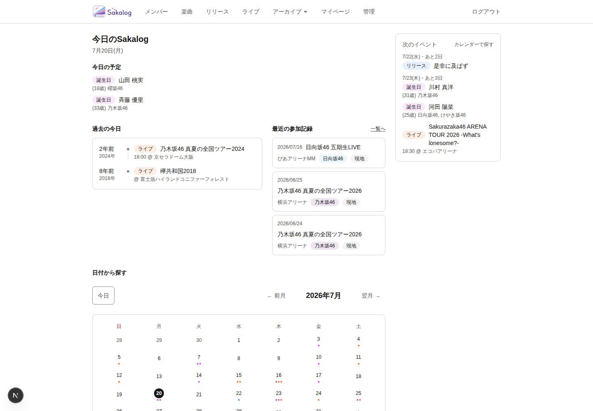

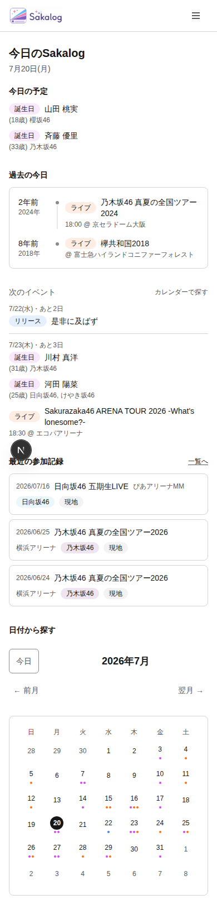

- 1440: `clientWidth / scrollWidth = 1440 / 1440`
- 390: `390 / 390`
- Mobile block height: Today Schedule 118px、Next Events 271px、Recent Attendance 270px。

### Step 2–3 — Calendar exploration and focused result

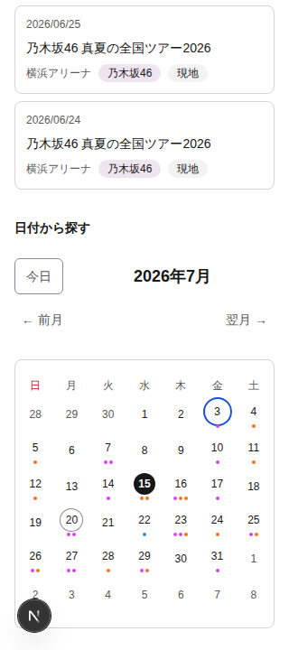

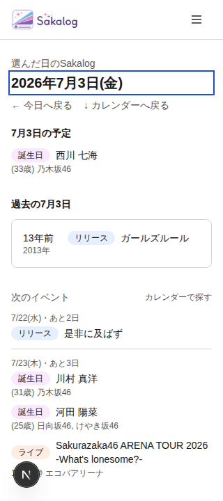

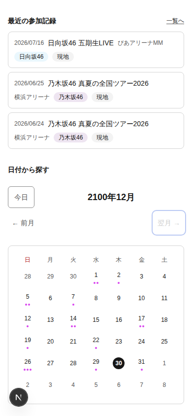

- Calendarはnative `table` 1件、date link 42件。
- selected accessible name: `2026年7月15日、選択中、イベント2件（ライブ2件）`。
- result H1はfocus済み、outline `2px solid rgb(29, 78, 216)`。
- 2100-12の「翌月」は`aria-disabled=true`のままfocusを保持し、bodyへ落ちない。

### Step 4 — Contextual live detail

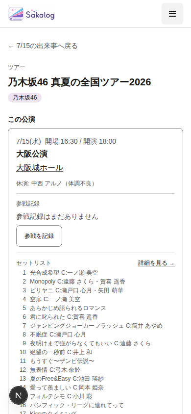

- `← 7/15の出来事へ戻る`を維持。
- 「この公演」の基本情報直後にattendance、その後にsetlist。
- root `390 / 390`。

### Step 5 — Direct fallback carousel

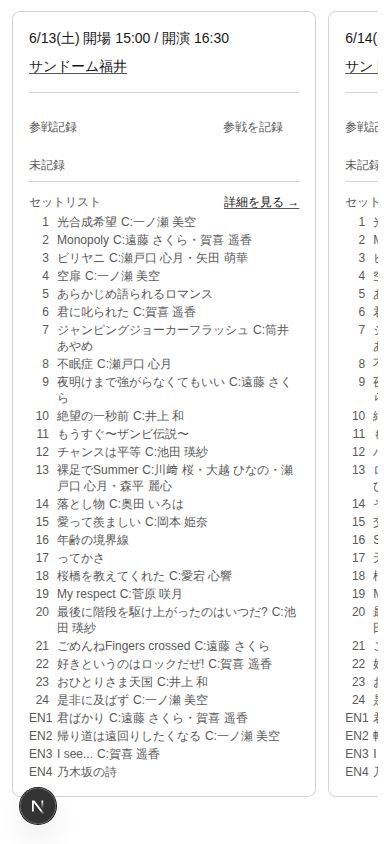

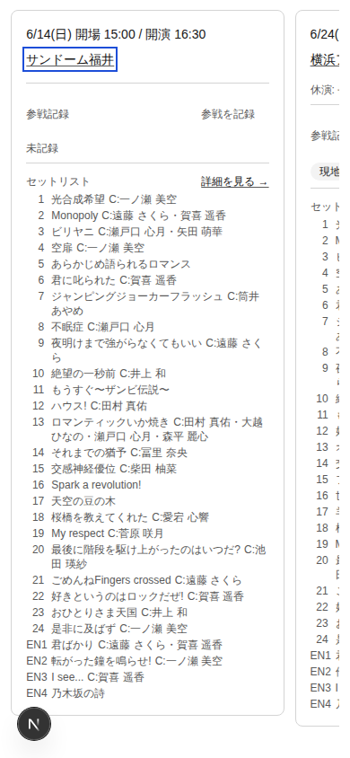

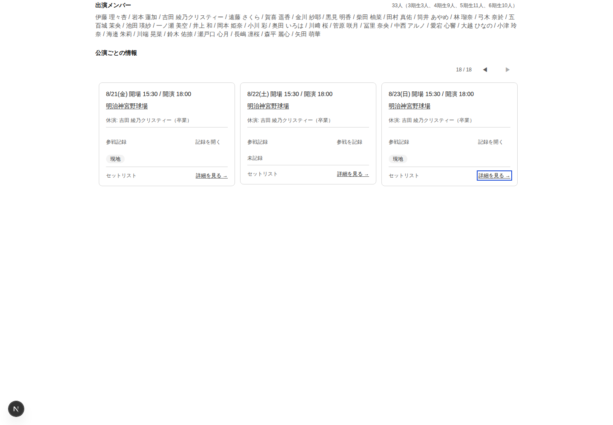

- 18 cards、初期full form 0、narrowのTab対象3、offscreen Tab対象0。
- active action: venue / attendance disclosure / setlist detail。
- wheel相当: `scrollLeft 4 → 637`、touch drag: `0 → 2849`、snapは`x mandatory`、root `scrollX=0`。
- 1440終端でfocused cardへcounter/statusが`18 / 18`として追従。focusはcarousel viewport内。
- cardsはcontent height（実測216–798px）で、最長cardへのsurface stretchを解消。

### Step 6 — Attendance validation error

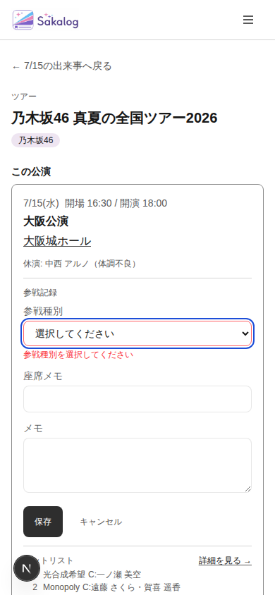

- form open時とvalidation後の両方で参戦種別Selectへfocus。
- `aria-invalid="true"`。
- `aria-describedby="attendedType-...-error"`とvisible error IDが一致。
- validation-onlyでデータ保存は行っていない。

### Step 7 — Navigation / reduced motion / theming

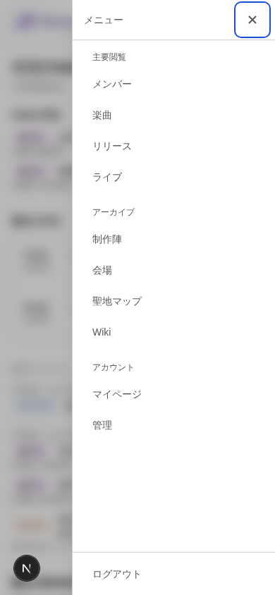

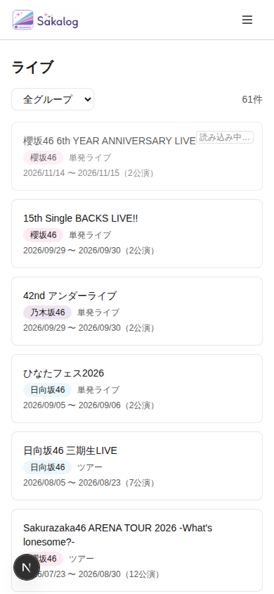

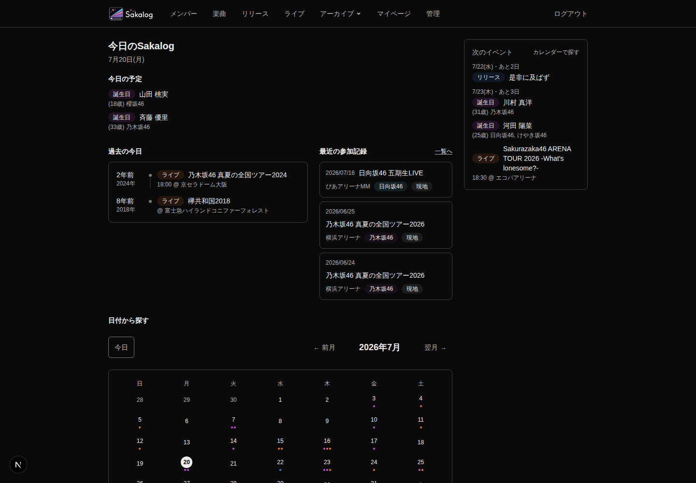

- drawer: `transition-property:none`、focus trap、HTML overflow hidden、Escape後openerへfocus return。
- pending: spinner `display:none`、static label `display:block`。
- dark themeで情報構造とroot幅を維持。

## 4. Baseline disposition

### 2026-07-15 CF-001〜CF-007

| Finding | Current status | 判定根拠 |
|---|---|---|
| CF-001 Daily Story hierarchy | **Resolved** | Desktop / MobileともDaily Story first。Mobile densityはCF-R10として分離。 |
| CF-002 Calendar semantics | **Resolved** | native table、weekday headers、full date/event accessible name、today/current、selected。 |
| CF-003 narrow/touch/result continuity | **Resolved** | 320 / 390 reflow、40–44px target、result H1 focus、boundary focus、return path。 |
| CF-004 date/performance context | **Resolved** | contextual URL、target performance、return dateを実操作確認。 |
| CF-005 state/focus/error/motion | **Resolved** | semantic tokens、2px focus、field error relation、drawer/pending reduce contract。 |
| CF-006 read cost / archive growth | **Resolved** | bounded 9 global calls + max3 attendance、parallel composition、current display parity。 |
| CF-007 copy / external affordance | **Improved** | `Today`は「今日」へ修正。external new-tab hintと一部`,`区切りは残る。 |

### 2026-07-16 CF-R01〜CF-R10

| Finding | Current status | 判定根拠 |
|---|---|---|
| CF-R01 direct fallback root overflow | **Resolved** | 320 / 390 / 1440でroot幅一致、inner carouselのみscroll。 |
| CF-R02 context-aware attendance presentation | **Resolved** | fallback初期form 0 / active最大1、context attendance-before-setlist、quiet danger。 |
| CF-R03 Calendar model / responsive interaction | **Resolved** | semantics、target、month/date result focus、boundary continuityを実測。 |
| CF-R04 semantic color / focus / current | **Resolved** | light/dark semantic tokens、2px focus、`aria-current`、contrast regression tests。 |
| CF-R05 reduced motion | **Resolved** | drawer movement除去、static pending/progress、focus return維持。 |
| CF-R06 shared form error / edit focus | **Resolved** | form open / first-invalid focus、invalid/describedby relation、alert contract。 |
| CF-R07 bounded global/personal read | **Resolved** | bounded contractとcache contractのunit 22件Pass。実表示parityもPass。 |
| CF-R08 unused Geist transfer | **Remaining** | Primary routeでwoff2を2本転送（現run 60,276B）。bodyはArial。 |
| CF-R09 copy / external affordance | **Improved** | 「今日」は解決。`target=_blank` video linkのaccessible hintと日本語区切り残差。 |
| CF-R10 Mobile Next Events density | **Remaining** | 271pxでToday Schedule 118pxの約2.3倍。順序は正しいが中盤の未来情報が重い。 |

既解決としてConsolidated Findingsから除外されていたCF-001、CF-004、#347 pending / save-cancel-delete focus lifecycleにも回帰は確認しなかった。**Regressedは0件。**

## 5. Impeccable reconciliation

`apps/oshikatsu-web/.impeccable/critique/`の既存Findingを現行commitへ再照合し、Product Designのbaseline dispositionと重複排除した。

| Critique cluster | Current status | 判定根拠 |
|---|---|---|
| Daily Story hierarchy / Next Events contract | **Resolved with P3 residue** | 探索期間、空状態、sort、Todayとの構造は解決。Mobile縦量だけをCF-R10へ統合。 |
| Past Same-Day state / single-year chrome / copy | **Resolved** | 選択日keyで展開stateをresetし、単一年railを省略、「残りN年分」へ明確化済み。 |
| Contextual Live Detail hierarchy / empty setlist / tour量 | **Resolved** | Critique最終snapshotで追加design Findingなし。今回のcontextual / fallback実操作でも回帰なし。 |
| Shared state / focus / error / motion | **Resolved** | CF-R04〜R06とFocused QAのP2を#359 / #360 / #364 / #376 / #390で解消。 |

Impeccable detectorはPrimary journey対象に1件、Arialを`overused-font`として警告した。ただしArialは`DESIGN.md`のDisplay / Body正典であり、装飾fontを増やさないOne-Family Ruleにも合致するため、Finding / Issueへ昇格しない。未使用Geistの転送costは別root causeとしてCF-R08に残す。

## 6. Issue disposition / backlog decision

今回の再監査にP0 / P1 / P2の残件はない。したがって、残る3件はP3 backlogとして独立起票し、P2以上の新規課題が出た場合はそちらを優先する。

| Finding | Priority | Issue | Boundary |
|---|---|---|---|
| CF-R08 unused Geist transfer | P3 / Backlog | [#397](https://github.com/kikun-dev/personal-hub/issues/397) | font load境界だけを変更し、Typography Decisionを変えない。 |
| CF-R09 copy / external affordance | P3 / Backlog | [#395](https://github.com/kikun-dev/personal-hub/issues/395) | new-tab accessible hintと日本語区切り。navigation primitiveは対象外。 |
| CF-R10 Mobile Next Events density | P3 / Backlog | [#396](https://github.com/kikun-dev/personal-hub/issues/396) | Mobile presentationのみ。件数、sort、read model、Desktop順序は維持。 |

### Highest-impact remaining opportunities

1. **CF-R08 / P3:** RootLayoutから未使用Geist Sansを外し、Geist MonoをWiki/Markdownへ局所化する。見た目を変えず固定転送を削減できる。
2. **CF-R09 / P3:** external video linkへ「新しいタブで開く」相当のaccessible hintを追加し、group名等の`,`を日本語区切りへ統一する。
3. **CF-R10 / P3:** Mobile Next Eventsを同日groupingは維持したままsecondary metadataを圧縮し、Todayより大きいread blockを落ち着かせる。

## 7. Verification and evidence limits

- Current-run screenshots: 320 / 390 / 1440、light / dark、keyboard、CDP touch、horizontal wheel、validation、reduced motion。
- Selected Playwright regression: 初回並列runは66 passed / 2 skipped / 2 failed。2 failureは単独`workers=1`再実行で両方Passし、current-run manual evidenceとも一致したため、product regressionではなくparallel/remote負荷flakeとして記録。
- Read/cache unit tests: 3 files / 22 tests passed。
- VoiceOver / NVDA等の実発話、実機touch慣性、実trackpad、WebKit / Firefox、200% / 400% zoom、high-contrast modeは未確認。
- full WCAG適合を主張しない。role/statusとaccessible treeの存在・更新は確認したが、実screen readerの発話順と重複は未確認。
- app codeと過去report snapshotは変更していない。本report、参照evidence、現行状態を示す索引 / PROJECT / roadmapだけを同期する。
