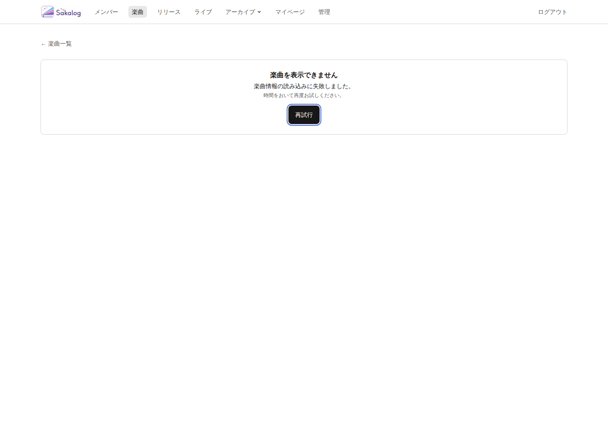
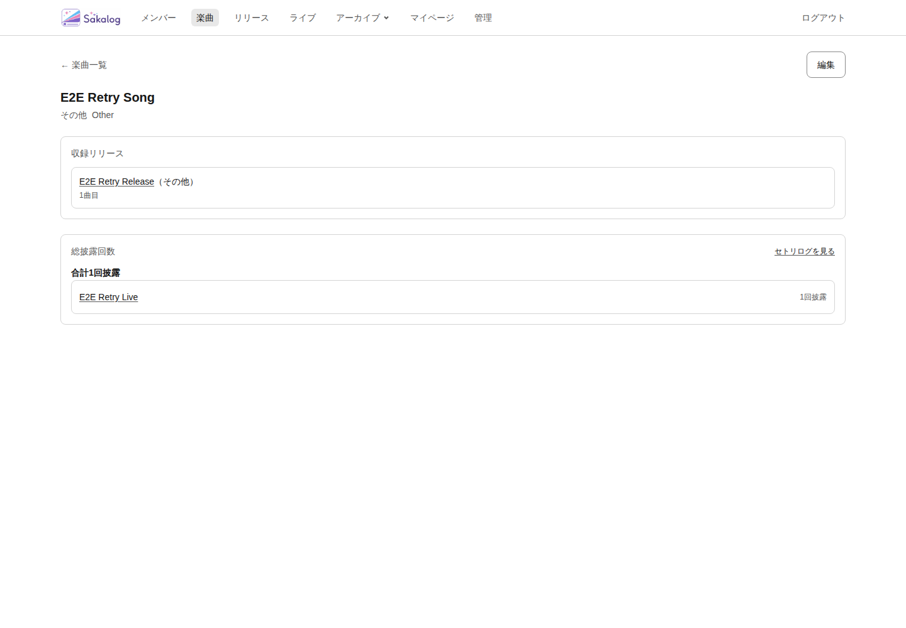
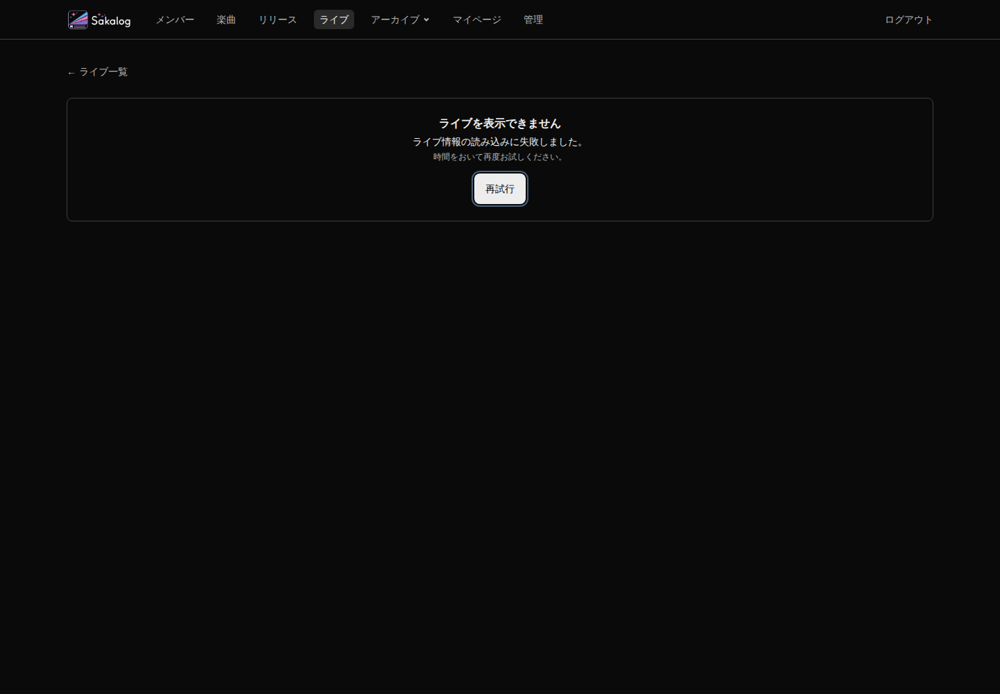
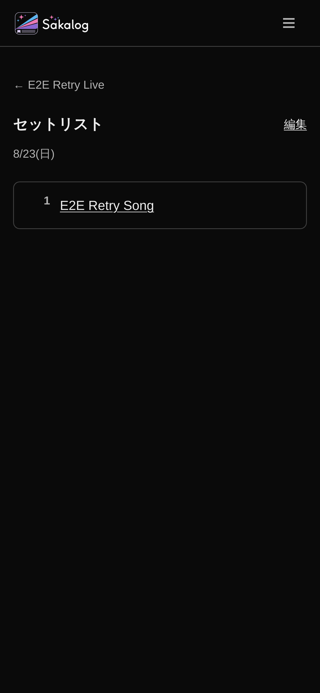

# Sakalog Error retry — #488 対象限定の再検証

- 実施日: 2026-09-05（Asia/Tokyo）
- 対象: `fix/488-error-retry-rsc`（base `256f697`）のローカルproduction build
- 関連: [Issue #488](https://github.com/kikun-dev/personal-hub/issues/488)、PR #487
- 前回: [2026-08-06 targeted re-audit](../../../apps/oshikatsu-web/design-qa-evidence/collection-route-state-contract-reaudit-2026-08-06/audit-report.md)
- 範囲: `RA-GF004-001`（retryで復帰しない）/ `RA-GF004-002`（40px target）
- 方式: 実DB障害を伴うPlaywright、component test、実画面スクリーンショットの確認。
  Product Design / Impeccableによる全体監査を再実施した記録ではない。

## 結果

対象の2件は、下記12条件の実route検証でPass。

| Route | Desktop light | Desktop dark | Mobile light | Mobile dark |
|---|---|---|---|---|
| Song detail | Pass | Pass | Pass | Pass |
| Live detail | Pass | Pass | Pass | Pass |
| Setlist detail | Pass | Pass | Pass | Pass |

DesktopはChromium 1440×1000、MobileはWebKit（iPhone 17 descriptor）390×844。
各条件の生データは [evidenceディレクトリ](./evidence/2026-09-05-sakalog-error-retry/) の
`error-retry-<Route>-retry-re-failure-recovery-<theme>--<project>.json`。
同名の `-cleanup.json` に各条件のSELECT復旧・専用fixture残件0の確認結果を保存した。
UUIDはテスト専用のランダム値であり、実ユーザーの記録ではない。

## 実装を選んだ根拠

1. プロダクトコード変更前に、3routeのDesktop lightで回帰E2Eを実行した。
   初期版のE2Eは44px assertionをまだ加えず、RSC requestに注目した。
   `reset()`単独では3件とも「Retry must initiate a fresh RSC request」で失敗し、
   **期待1件に対して実測0件**だった。全失敗後にcleanup成功を確認した。
2. 同一の `startTransition` 内で `router.refresh()` → `reset()` を行う候補を実装した。
   実routeで再失敗・pending解除・その後の正常復帰が3routeとも成立したため採用した。
   処理順を先に確定仕様とせず、E2Eの結果を採用根拠にした。
3. 12条件へ広げても以下の契約が成立した。逆順が不可能という主張はしない。
   新たな状態管理層、タイマー、full reload、URL nonce、依存更新は不要だった。

## 要求ごとの証拠

| 要求 | 観測・assertion | 結果 |
|---|---|---|
| 障害解除後に新しいRSC request | SELECTを復元・確認してからRetryし、対象pathnameかつ `RSC: 1` の実requestを監視 | 各1件 |
| full reloadなしの正常復帰 | Retry開始後のdocument navigation数、documentElementへ付けた一意marker、URL不変、正常h1・セットリストの楽曲linkを確認 | navigation 0、marker維持、正常表示 |
| 再取得中の二重操作防止 | 実RSC requestをgateで保留し、disabled / `aria-busy=true` / 「再試行中…」を確認。mouse click / Enter / Spaceを追加実行 | 保留中・復帰後ともrequestは各1件 |
| 再失敗後に再Retry可能 | 最初のRetryでは障害を残す。応答後にError本文とenabledなRetryを確認し、その後に障害解除・2回目のRetry | 全12条件で成立 |
| Song / Live / Setlist共通 | 3routeすべてが同じspecの状態遷移・request assertionを通る | 全12条件で成立 |
| GF-SAKA-002の操作領域 | 既存 `standaloneTargetMinHeightClass` を使用し実DOMを計測 | 全条件44px、keyboard outline 2px |

Error本文のalert、h1、内部例外情報の非表示、既存recovery hrefを確認した。
Error / pending / 再失敗 / 正常復帰の各状態でpage-level horizontal overflowはない。
Next.js自身のroute announcerもalertを持つため、Errorのassertionは`main`内へ限定した。

## cleanupの確認

- 障害管理はPlaywright workerとは別のNodeプロセスが所有する。
- テストfixtureの`finally`でSELECTを復元し、`has_table_privilege`で確認してから
  専用UUIDのlive / song / releaseを削除する（関連公演・setlistはFK cascade）。
- fixture teardownは本体とは別budget。worker消失時はIPC disconnectで同じcleanupを行う。
  SIGINT / SIGTERM / watchdogもcleanupへ接続している。
- 回帰E2Eのassertion失敗3件の後、すべてでcleanup成功を確認した。
- 一時的な検証用specで `fail-song` / `fail-live` 後に未解決Promiseを待ち、
  `test.setTimeout(1500)` により**実際のテストtimeoutを各1件発生**させた。
  2件ともtimeoutで終了し、それぞれのfixture teardownがSELECT復元を確認した。
  意図的に失敗させる検証用specは確認後に取り除いた。
- 続いて独立したpsqlで両tableの `service_role / SELECT / is_grantable=NO` を確認。
  専用song / live / releaseはすべて0件だった。
- Docker / DB停止や障害管理プロセス自体へのSIGKILLまで復旧を保証するものではない。
  SQL実行不能の場合はcleanup失敗として報告し、排他lockを残す。

## 検証コマンド

`apps/oshikatsu-web` cwd:

```bash
pnpm typecheck
pnpm lint
pnpm test:unit
pnpm test:component
pnpm test:e2e:local -- error-retry
pnpm test:e2e:local
```

- typecheck / lint: Pass
- unit: 31 files / 313 tests Pass
- component: 20 files / 101 tests Pass
- targeted E2E: 12 passed / 0 skipped / 0 failed
- cleanupの命令ID照合を含む最終版でも、targeted E2Eを再実行し12件Pass（1.1分）。
- full E2E: 349 passed / 5 skipped / 0 failed（10.2分）。既存337 pass / 5 skipに対し対象12件を追加。

## 代表スクリーンショット








## 判定範囲

`RA-GF004-001` / `RA-GF004-002` の実装残件は本検証範囲で解消。
GF-SAKA-004全体の過去のPass記録は8月6日のレポートを維持し、今回その内容を書き換えていない。
root Error Boundary、閲覧元を保持するnavigation設計、全体UXの再評価は対象外。
